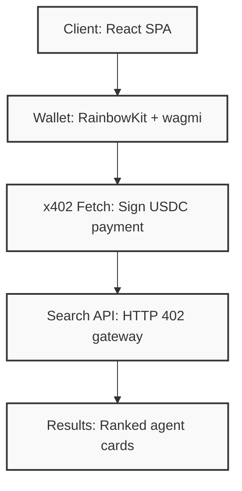

  

<h2 align="center">8004</h2>

  Semantic search for on-chain AI agents. 
  Payment-gated discovery powered by the x402 protocol.

  
  
  
  
  
  
  

  <a href="https://8004.qntx.fun">Live Demo</a>&ensp;·&ensp;
  <a href="https://docs.qntx.fun">Documentation</a>&ensp;·&ensp;
  <a href="https://github.com/qntx/erc8004">ERC-8004 Spec</a>

---

## Overview

**8004** is a fully client-side semantic search interface for discovering AI agents registered under the [ERC-8004](https://github.com/qntx/erc8004) standard. Every search query is payment-gated via the [x402](https://www.x402.org/) protocol — connect a wallet, sign a USDC micropayment, and get results. No API keys. No backend accounts. No subscriptions.

**Agents pay to discover agents. Humans pay to discover agents. The protocol doesn't care.**

## Architecture

Every search follows the same stateless cycle: **query → HTTP 402 → sign payment → retry with signature → ranked results**. The client holds no session state; the gateway holds no user credentials.

## Features

- **Semantic search** — Natural language queries against all ERC-8004 registered AI agents across multiple EVM chains
- **Payment-gated access** — Per-query USDC micropayments via x402, settled on Monad
- **Multi-chain discovery** — Agents from Ethereum, Base, Arbitrum, Optimism, Polygon, Avalanche, BNB Chain, and more
- **Rich agent cards** — Name, description, relevance score, chain badge, service tags, x402 support, trust indicators
- **Cursor pagination** — Infinite scroll through large result sets without re-signing
- **Dark / light theme** — System-aware with manual override, persisted to localStorage
- **Fully client-side** — Static SPA deployed to GitHub Pages, zero backend infrastructure

## Infrastructure

Part of QNTX's open-source ecosystem for autonomous AI agents:

- **[`erc8004`](https://github.com/qntx/erc8004)** — Trustless agent identity standard (ERC-8004)
- **[`facilitator`](https://github.com/qntx/facilitator)** — Settlement server for on-chain payment verification
- **[`r402`](https://github.com/qntx/r402)** — Rust implementation of the x402 protocol
- **[`chat`](https://github.com/qntx/chat)** — AI chat interface with per-message micropayments

## Deployment

Automatically deployed to GitHub Pages on every push to `main` via the [qntx/workflows](https://github.com/qntx/workflows) reusable workflow.

## License

This project is licensed under the BSD 3-Clause License — see the [LICENSE](LICENSE) file for details.
